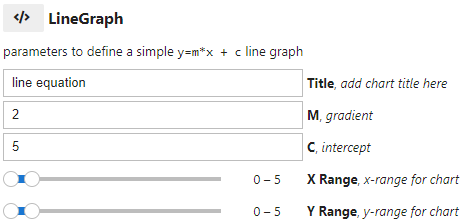

# ipyautoui

A high-level wrapper library that sits on top of [__ipywidgets__](https://github.com/jupyter-widgets/ipywidgets) (and other ipy- widget libraries), [__pydantic__](https://github.com/samuelcolvin/pydantic/) and Jupycter rich display system to template and automate the creation of widget forms / user-interfaces. The core user-facing classes in this library are __AutoUi__ and __AutoDisplay__:
```python
from ipyautoui import AutoUi, AutoDisplay
```

## Installation

```
# TODO: do this! 
# TODO: consider having 2stage installation, specifying the installation of vuetify stuff... 

mamba install ipyautoui -c conda-forge  # mamba ...
conda install ipyautoui -c conda-forge  # or conda ...
pip install ipyautoui  # or pip ...
```

## AutoUi

```python
from pydantic import BaseModel, Field
from ipyautoui import AutoUi

class LineGraph(BaseModel):
    """parameters to define a simple `y=m*x + c` line graph"""
    title: str = Field(default='line equation', description='add chart title here')
    m: float = Field(default=2, description='gradient')
    c: float = Field(default=5, description='intercept')
    x_range: tuple[int, int] = Field(default=(0,5), ge=0, le=50, description='x-range for chart')
    y_range: tuple[int, int] = Field(default=(0,5), ge=0, le=50, description='y-range for chart')
    
lg = LineGraph()
ui = AutoUi(pydantic_obj=lg)
ui
```


```python

ui.value  # there is a `value` trait that is always kept in-sync with the widget input form
# {'title': 'line equation',
#  'm': 2,
#  'c': 5,
#  'x_range': (0, 5),
#  'y_range': (0, 5)}

#  methods / stored values
ui.file #  file data to .json file
ui.value #  input form value dict
ui.pydantic_obj #  input form pydantic model (note. value is created from this on_change)
AutoUi.create_displayfile_renderer #  creates a json-serializable pointer 
AutoUi.parse_file #  init ui with data from .json file
```

- AutoUi uses [__pydantic__](https://github.com/samuelcolvin/pydantic/) to define the schema of User Input form, and then infers the widget to use based on type and user-directives
- `ipyautoui.custom.` provides useful widgets (e.g. iterable) that aren't included within the core ipywidgets library
- ipyautoui defines a best practice for creating and integrating custom widgets, and as default includes some widgets from other opular widget libraries (e.g. ipydatagrid, ipyfilechooser). 
- ipyautoui handles observing the values, and maintains a stateful and validated `.value` parameter for the whole user input form.  
- TODO: AutoUi also allows the user to specify the usage of [__ipyvuetify__](https://github.com/widgetti/ipyvuetify) and 
    - __note__. this is the recommended approach for simple and generic input forms. Where custom UI objects are required these can be built using the ipyautoui core library. 
    
## AutoVuetify

`AutoVuetify` works in exactly the same way as `AutoUi`, but instead of using `ipywidgets` to render the JSON schema it uses [ipyvuetify](https://github.com/widgetti/ipyvuetify) and [vuetify-jsonschema-form](https://github.com/koumoul-dev/vuetify-jsonschema-form).

## Should I use AutoUi or AutoVuetify?

### AutoVuetify

The excellent documentation for [__vuetify-jsonschema-form__](https://koumoul-dev.github.io/vuetify-jsonschema-form/latest/) can be used to create your schema. Anything possible
in vjsf is therefore possible using AutoVuetify (TODO: implement markdown editor). This has a much more complete coverage of the json-schema specification, as well as the added
benefit of out-the-box support of mobile applications. It falls down if you want to specify custom renderer objects. 

```{note}
when you're using pydantic to make the schema, "-" cannot be used field names, but requires them (e.g. "x-display"), use "x_display" instead and AutoVuetify does the conversion). 
```

### AutoUi

The main benefit of AutoUi (and main reason for continuing to develop it), as it is simple to create custom renderers for parts of the json-schema, facilitating the specific 
requires of a custom project. See [custom-renderers](custom-renderers.ipynb).

## AutoDisplay 

`(TODO: name change to display, facilitating display of database data?)`

- AutoDisplay uses Jupyter's rich display system and large ecosystem of 3rd party packages to create a simple and unified display wrapper to various filetypes.
- The renderer for a given file is inferred from the file extension. 
     - TODO: where the datasource is not a file, the extension is a mapping code that maps a renderer to the datastructure of the data. 
- Custom renderer's can be passed to `AutoDisplay` allowing it to display user-defined filetypes (or compound extension filetypes)


## How it works: 

```mermaid
  graph TD;
      A-->B;
      A-->C;
      B-->D;
      C-->D;
```

- Make a pydantic model (or json schema) that defines the UI
- Pass the model to `AutoUi` to generate an user-interface
- Save the UI fields to file 
- Assign a compound-json filetype to the schema and generate `AutoDisplay` rendererer
- Use `AutoDisplay` to display the json file using the AutoUi interface

## Dependencies

This package intends to be high-level, and unifies many other ipy- libraries under a simple and familliar API. 

- [pydantic](https://github.com/samuelcolvin/pydantic/) 
- [ipywidgets](https://github.com/jupyter-widgets/ipywidgets)
- [ipydatagrid](https://github.com/bloomberg/ipydatagrid)
- [ipyfilechooser](https://github.com/crahan/ipyfilechooser)
- [ipyvue](https://github.com/widgetti/ipyvue)
- [ipyvuetify](https://github.com/widgetti/ipyvuetify)
- [vuetify-jsonschema-form](https://github.com/koumoul-dev/vuetify-jsonschema-form)
- [Altair](https://github.com/altair-viz/altair) (for viewing `.vg.json` files)
- [Plotly](https://github.com/plotly/plotly.py) (for viewing `.plotly.json` files)

It is obviously wholly dependent on the excellent json-schema specification:
- [json-schema](https://json-schema.org/)

## Development installation

For a development installation (requires JupyterLab (version >= 3), yarn, and mamba.):

```
$ git clone https://github.com/jgunstone/ipyautoui
$ cd ipyautoui

# edit the PYTHONPATH variable in the following files:
# - /.vscode/dev.env
# - environment-dev.yml
$ mamba env create --file environment-dev.yml
```

## Contributions 

AutoVuetify is a very thin wrapper where ipyvuetify and vuetify-jsonschema-form are doing all the work. 
Many thanks to @mariobuikhuizen for providing me with the [boiler-plate code](https://github.com/widgetti/ipyvuetify/issues/182).
